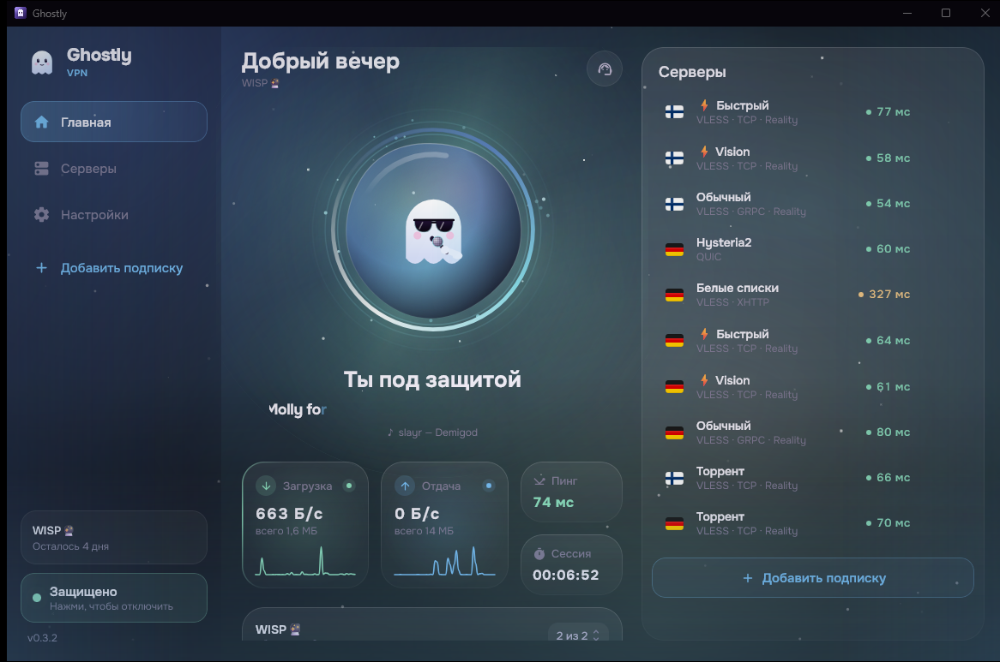

<p align="center"></p>

<h1 align="center">Ghostly VPN</h1>

<p align="center">
Открытый VPN-клиент на ядре Xray для Android, iOS, Windows, macOS и Linux.<br>
Подписки VLESS · VMess · Trojan · Shadowsocks · Hysteria2 · XHTTP · Reality.
</p>

<p align="center">
  <a href="https://github.com/Nelxi/ghostly-vpn/releases/latest"></a>
  
  
</p>

<p align="center"></p>

## Скачать

| Платформа | Файл |
|---|---|
| Android 8+ | [Ghostly-Android.apk](https://github.com/Nelxi/ghostly-vpn/releases/latest/download/Ghostly-Android.apk) (arm64, подходит почти всем) · [универсальный](https://github.com/Nelxi/ghostly-vpn/releases/latest/download/Ghostly-Android-universal.apk) |
| Windows 10/11 | [Ghostly-Windows.exe](https://github.com/Nelxi/ghostly-vpn/releases/latest/download/Ghostly-Windows.exe) — обычный установщик, без прав администратора и без MSI |
| macOS · iPhone · Linux | скоро |

Подписку можно купить на [ghostlynex.fun](https://ghostlynex.fun), но приложение работает с любой подпиской VLESS / VMess / Trojan / Shadowsocks / Hysteria2.

---

## Возможности

- **Подключение в одно касание** — живой призрак-кнопка, таймер сессии, скорость загрузки и отдачи в реальном времени.
- **Любые подписки** — ссылка, base64, JSON-конфиги Xray (как в Happ), диплинки `ghostly://`, `happ://add/`, QR-код, «Поделиться → Ghostly».
- **Быстрее обычных клиентов**
  - подписка скачивается наперегонки: напрямую, через зеркало и через уже поднятый туннель — побеждает первый ответ;
  - двухфазный пинг: мгновенный TCP-пинг всех серверов, затем реальная задержка через ядро (на ПК — один процесс Xray на все серверы);
  - на ПК подключение готово, как только локальный порт отвечает (~100 мс), без фиксированных задержек.
- **Умная маршрутизация** — российские сайты напрямую, остальное через VPN; свои правила «напрямую / через VPN / блок»; блокировка рекламы.
- **Сторож соединения** — каждые 20 секунд проверяет, что трафик реально идёт через туннель, и сам переходит на рабочий сервер.
- **Умные белые списки** — сам уходит на серверы белых списков при блокировках мобильного интернета и возвращается на обычные, как только ограничения снимут.
- **Автосмена сервера** при падении, автоподключение, запуск при включении устройства.
- **Раздельное туннелирование по приложениям** (Android), плитка в шторке, kill switch через системную «Постоянную VPN».
- **Локальный прокси** SOCKS5 + HTTP с логином и паролем (`ghostly_…`), настраиваемые порты, автоматический обход занятых портов.
- **ПК:** режим TUN (весь трафик) или системный прокси, трей, тёмный заголовок окна, отдельная десктопная раскладка.
- **Пулы трафика** Ghostly (белые списки / обычные серверы) с отдельными полосками и датой обновления.
- DNS через туннель (Cloudflare, Google, Quad9, AdGuard или свой), IPv6, MTU, мультиплекс, фрагментация TLS.

## Сборка

Нужны JDK 21 и Android SDK (для Android).

```bash
./gradlew :androidApp:assembleRelease       # APK по архитектурам + универсальный
./gradlew :desktopApp:run                   # запустить на ПК
./gradlew :desktopApp:packageDistributionForCurrentOS   # MSI/EXE, DMG или DEB/RPM
./gradlew :shared:jvmTest                   # тесты парсеров и сборщика конфигов
```

Ядро Xray скачивается при сборке и проверяется по sha256 (`gradle/libs.versions.toml`):
Android — [AndroidLibXrayLite](https://github.com/2dust/AndroidLibXrayLite), ПК — [Xray-core](https://github.com/XTLS/Xray-core).
iOS-приложение собирается на macOS (см. `iosApp/`).

## Устройство

```
shared/        общий код (Kotlin Multiplatform + Compose Multiplatform)
  core/        модели, парсер ссылок и подписок, сборщик конфига Xray, контроллер
  ui/          весь интерфейс: тема, компоненты, экраны, десктопная оболочка
androidApp/    VpnService (TUN-дескриптор напрямую в ядро Xray), плитка, QR, автозапуск
desktopApp/    процесс Xray, системный прокси (Windows/macOS/Linux), трей, автозапуск
iosApp/        оболочка SwiftUI
```

## Лицензия

GPL-3.0. Ядро Xray — MPL-2.0, AndroidLibXrayLite — LGPL-3.0, шрифт Onest — SIL OFL 1.1 (`licenses/`).
